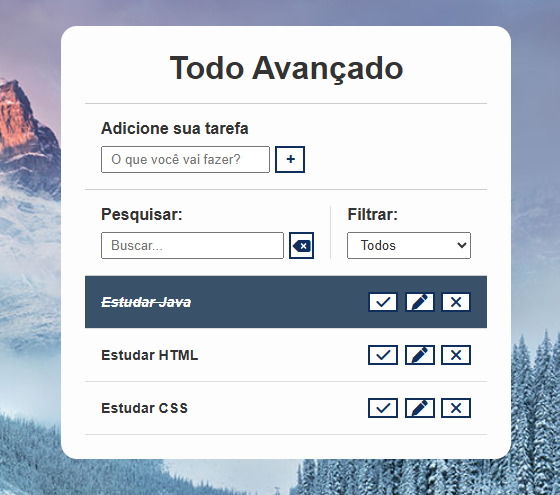

# TO DO AVANÇADO
---
Projeto de editor de tarefas aonde foram possíveis treinar técnicas de :

* LocalStorage ( Udpdate - Revove - Add)
* Eventos (Submit - onclick - Keyup - change)

Nesse projeto podemos adicionar, pesquisar e filtrar as tarefas. Esse projeto contém 3 ações que são:

* Edição,

* Concluído e

* Exclusão

Atráves do filtro podemos escolher tarefas que são salvas segundo sua categoria que pode ser (feitos - a fazer - concluído ).
Por meio do pesquisar digitamos parte de uma sentença de tarefa e abaixo ele nos mostra a tarefa e sua condição.

Segue o link para vocês verem como ficou o projeto.

https://todoavancado.netlify.app